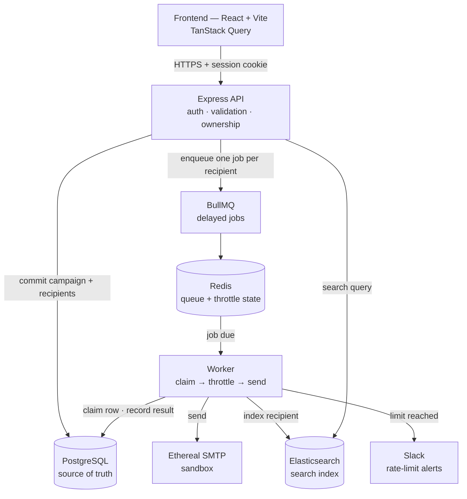

# ReachInbox Email Scheduler

**Live demo: https://reachinbox-3qcm.onrender.com**

> Hosted on Render's free tier, which spins the instance down when idle — the
> first request can take **50 seconds or more** while it wakes. Subsequent
> requests are fast. Mail goes to Ethereal, a capture-only sandbox, so nothing
> is ever delivered to a real inbox.

Schedule an email campaign to a list of recipients, have it delivered reliably
at the right time and at a controlled pace, and see exactly what happened.

React + TypeScript on the front, Express + TypeScript on the back, with
PostgreSQL as the source of truth, Redis + BullMQ for scheduling, Elasticsearch
for search, and Ethereal as the mail sandbox.

---

## Overview

A user signs in with Google, composes an email, uploads or pastes a recipient
list, and picks a start time and a pace. The API writes the campaign and one row
per recipient to PostgreSQL, then enqueues one **BullMQ delayed job per
recipient**. A worker wakes up at each job's due time, claims the row, checks
the Redis throttle, sends through Ethereal, and records the result.

The design goal throughout is that nothing is lost and nothing is sent twice —
across process restarts, worker crashes, duplicate requests and concurrent
workers. **No cron is used anywhere in this project.**

---

## Features

### Backend

| Requirement | Implementation |
| --- | --- |
| **Express** | Express 4 + TypeScript, Zod-validated, one response envelope, centralised error handling |
| **PostgreSQL** | Prisma 7 — `User`, `Sender`, `EmailJob`, `EmailRecipient`, `SlackConnection`, with FKs, unique constraints and indexes; the durable source of truth |
| **BullMQ** | One delayed job per recipient; job id **is** the idempotency key |
| **Redis** | Queue state (AOF-persisted) plus throttle counters and pace markers |
| **Ethereal** | The only transport. Captures mail, never delivers it. Stores `providerMessageId` + preview URL |
| **Elasticsearch** | Projection of the database for search; the API degrades to PostgreSQL when it is down |
| **Rate limiting** | Per-sender hourly ceiling and minimum inter-send delay, enforced atomically in Redis (no in-memory counters). Plus HTTP rate limits per user/IP |
| **Concurrency** | `WORKER_CONCURRENCY` sends in flight per worker; safe to run many workers |
| **Persistence** | Delayed jobs survive restarts in Redis; a boot-time reconciliation pass re-enqueues anything PostgreSQL still considers pending |
| **Idempotency** | Database unique constraints + delivery leases make each send at-most-once; `Idempotency-Key` deduplicates the schedule request itself |
| **Slack notifications** | Real Slack OAuth v2; one alert per sender per hour window when the limit is hit; tokens encrypted at rest |
| **Bull Board** | Live queue dashboard at `/admin/queues`, behind auth + admin role |

### Frontend

| Requirement | Implementation |
| --- | --- |
| **Google OAuth** | Real server-side authorisation-code flow. No mock login |
| **Dashboard** | Summary cards plus scheduled/sent tabs, all live from the API |
| **Compose Email** | Subject, body, recipients, start time, delay between emails and hourly limit, with a live summary of what is about to happen and a confirmation panel afterwards |
| **CSV upload** | Drag-and-drop or browse; parses CSV/TXT, reports valid / invalid / duplicate — and the backend re-validates independently |
| **Scheduled emails** | Server-paginated, filterable, cancellable |
| **Sent emails** | Delivery history with status, timestamps and Ethereal preview links |
| **Search** | Full-text search over the signed-in user's own email, backed by Elasticsearch |
| **Slack connection** | Connect / status / disconnect from the dashboard and Settings |

---

## Architecture



Two things worth noting in the diagram: the worker writes back to PostgreSQL
(the queue never holds the truth), and both Elasticsearch and Slack hang off the
worker as **fire-and-forget** side effects — neither can delay or fail a send.

Job payloads carry only ids. No subject, body or recipient address is ever
stored in Redis.

The four mechanisms behind that diagram each get their own section below:

| How it works | Section |
| --- | --- |
| Scheduling — BullMQ delayed jobs, and why no cron | [Scheduling Architecture](#scheduling-architecture) |
| Persistence across a restart | [Persistence](#persistence) |
| Not sending the same email twice | [Idempotency](#idempotency) |
| Rate limiting — minimum delay and hourly ceiling | [Rate Limiting](#rate-limiting) |
| Worker concurrency | [Concurrency](#concurrency) |

---

## Scheduling Architecture

> **NO CRON IS USED.** There is no `node-cron`, no `cron`, no `agenda`, no
> `setInterval`-based scheduler, and no OS cron entry anywhere in this project.

Scheduling is entirely **BullMQ delayed jobs**:

1. `POST /api/emails/schedule` validates the request and writes the `EmailJob`
   and its `EmailRecipient` rows in a transaction. This commit is the point of
   no return — from here the campaign exists whatever happens next.
2. For each recipient, `computeSendTime` derives an absolute due time from the
   campaign start, the recipient's index, the requested delay and the campaign's
   hourly limit.
3. One job per recipient is added to the `email-send` queue with
   `delay = dueTime − now`. The job's `jobId` is the recipient's
   **idempotency key** (a sha256 of job id + address), so Redis itself rejects a
   duplicate.
4. Redis holds delayed jobs in a sorted set keyed by run timestamp. BullMQ
   promotes a job to the wait list when its time arrives and a worker picks it
   up. Nothing polls the database.
5. The worker loads the recipient, claims it, checks the throttle, sends, and
   records the outcome.

A deferred send is not a failed send: the worker calls `job.moveToDelayed(runAt)`,
which puts the same job back into the delayed set at a later timestamp without
consuming a retry attempt.

---

## Persistence

**After a server restart, in-flight campaigns resume — they do not restart.**

- Delayed jobs live in Redis, which runs with AOF enabled, so the queue survives
  a restart of the API, the worker, or Redis itself.
- On boot, `recoverPendingSends()` scans PostgreSQL for every recipient the
  database still considers unsent and re-enqueues it. This is **reconciliation
  run once at startup**, not a scheduler — there is no timer behind it.
- Re-enqueueing is free when the job already exists: the job id is the
  idempotency key, so BullMQ treats the add as a no-op.
- Recovery also picks up rows stuck in `PROCESSING` whose **delivery lease has
  expired** — a worker that died mid-send. Normally BullMQ's stalled-job
  detection handles that, but it can only do so while the job still exists in
  Redis; if Redis was flushed or the job was evicted, nothing else would ever
  pick the row up. An expired lease proves no send is live, so re-enqueueing is
  safe.

It earns its keep when Redis was flushed, was down during a schedule call, or
the process died between the database commit and the enqueue.

---

## Idempotency

Duplicate sending is prevented at three independent layers, all of them durable.
None of it relies on in-memory state.

**1. The request.** `POST /api/emails/schedule` accepts an `Idempotency-Key`
header, stored under a `@@unique([userId, idempotencyKey])` constraint. A retry
of the same key returns the original campaign with HTTP 200 and
`deduplicated: true` rather than creating a second one. A double-clicked button
or a retried network request cannot duplicate a campaign.

**2. The job.** Each recipient has a deterministic idempotency key —
`sha256(emailJobId + email)` — under a unique constraint, and that same string
is the BullMQ `jobId`. Enqueueing the same recipient twice is rejected by Redis.
A `@@unique([emailJobId, email])` constraint stops the same address appearing
twice in one campaign.

**3. The send.** Before sending, the worker **claims** the row with a
conditional update:

```ts
UPDATE "EmailRecipient"
   SET status = 'PROCESSING', lockedBy = :workerId, lockedAt = now(), attempts = attempts + 1
 WHERE id = :id
   AND (status IN ('PENDING','SCHEDULED') OR (status = 'PROCESSING' AND lockedAt < :staleBefore))
```

The update is atomic, so exactly one worker gets a row count of 1 and everyone
else gets 0 and stops. Reading the status and then sending would race; claiming
cannot. The lease has a timeout, so a worker that dies does not park the row
forever. The claim is released owner-checked, so a late worker cannot stomp a
newer one's state.

---

## Rate Limiting

Two limits apply to every send, both enforced in Redis so they hold across
multiple workers, multiple backend instances and restarts. **There are no
in-memory counters.**

| Variable | Meaning | Default |
| --- | --- | --- |
| `MIN_EMAIL_DELAY_MS` | Minimum gap between two sends from the same sender | `1000` |
| `MAX_EMAILS_PER_HOUR` | Ceiling per sender per hour window | `100` |

A campaign's own `hourlyLimit` may be lower than `MAX_EMAILS_PER_HOUR`; the
smaller of the two always wins.

**Redis-backed counters.** State is two keys per sender:

```
email_rate:{senderId}:{hourWindow}   counter, one per sender per hour
email_pace:{senderId}                epoch ms at which the next send may go
```

`hourWindow` is `floor(epochMs / 3600000)` — a fixed bucket every machine
resolves identically without coordinating. The counter's TTL runs just past the
end of its window, so buckets expire themselves; nothing sweeps them.

**Multi-worker safety.** Before each send the worker runs a single **Lua
script** that atomically (a) reads the counter and refuses if the limit is
reached, (b) reads the pace marker and refuses if the previous send was too
recent, or else (c) reserves the slot — `INCR` the counter, refresh its TTL, and
push the pace marker to `now + MIN_EMAIL_DELAY_MS`. Because check and reserve
happen inside one script, workers racing for the last slot produce exactly one
winner. Verified: 500 concurrent acquires against a limit of 100 granted exactly
100.

**When the limit is reached** the script returns the time until the window rolls
over instead of granting a slot.

**Rescheduling behaviour.** A refusal is not a failure. The worker releases its
database claim, refunds the attempt, writes the new time back to PostgreSQL, and
calls `job.moveToDelayed(runAt)` — deferred as a delayed job, never dropped,
never failed, no retry consumed. Ordering is preserved by giving each deferred
job an offset of `rank × MIN_EMAIL_DELAY_MS` among the campaign's still-pending
recipients, so recipients 11–20 move to the next window in their original order
rather than waking simultaneously. If a send throws *after* reserving a slot,
the slot is returned so a retry is not charged twice.

Separately, the HTTP API is rate limited per authenticated user (per IP when
anonymous): `RATE_LIMIT_API_PER_MINUTE` (300), `RATE_LIMIT_AUTH_PER_MINUTE`
(20), `RATE_LIMIT_HEAVY_PER_MINUTE` (30, for scheduling and file validation).

---

## Concurrency

`WORKER_CONCURRENCY` (default `5`) sets how many sends one worker processes
simultaneously. The worker can run inside the API process (`WORKER_ENABLED=true`,
the default) or as its own process:

```bash
WORKER_ENABLED=false npm run dev    # API only
npm run worker                       # sender, separately
```

Scaling out is safe by construction: delivery leases make the claim atomic, the
throttle lives in Redis rather than in any process, and BullMQ hands each job to
exactly one consumer. Failed sends retry `EMAIL_JOB_ATTEMPTS` times with
`EMAIL_JOB_BACKOFF_MS` backoff. Shutdown is graceful — the worker stops taking
new jobs and finishes what it holds.

---

## Slack

Real Slack OAuth v2 — nothing about it is mocked.

| Endpoint | Purpose |
| --- | --- |
| `GET /api/slack/connect` | Start the install (redirects to Slack) |
| `GET /api/slack/callback` | Handle Slack's redirect |
| `GET /api/slack/status` | Connected / disconnected |
| `POST /api/slack/disconnect` | Revoke the connection |

**OAuth.** `connect` mints a random `state` into a short-lived httpOnly cookie
and redirects to Slack. The callback compares `state` in constant time and
exchanges the code for a token **server-side**. The client secret never reaches
the browser, and no token, webhook URL, OAuth code or ciphertext is written to a
log.

**Connection.** The bot token and incoming-webhook URL are AES-256-GCM encrypted
with `ENCRYPTION_KEY` before they reach the database and decrypted only at send
time.

**Disconnect** marks the connection revoked and clears the stored credentials.
**Reconnect** simply repeats the install; the record is keyed
`@@unique([userId, teamId])`, so re-installing the same workspace updates the
existing connection rather than accumulating duplicates.

**Rate-limit notification.** When a sender exhausts its hourly budget, one
message is posted per sender per hour window — claimed with Redis `SET NX`, so a
window that defers 200 emails still produces exactly one alert:

> :warning: Email rate limit reached for sender *dev@reachinbox.local*
> (100/hour). Remaining emails have been rescheduled and resume after …

**Slack is never load-bearing.** A missing connection, a revoked token or a Slack
outage resolves to "not delivered" and is logged. The send pipeline is
unaffected and the worker does not crash.

---

## Elasticsearch

**PostgreSQL is the source of truth; Elasticsearch is a projection of it.**

**Indexing** happens after each state change — when a campaign is scheduled,
after each send succeeds or fails, and when a campaign is cancelled — always
fire-and-forget, so the index can never delay or fail a send. Documents carry
`recipientId`, `emailJobId`, `userId`, `senderId`, `email`, `subject`, `status`,
`scheduledAt` and `sentAt`.

**Search** is `GET /api/emails/search?q=…&status=…&page=…&pageSize=…`, over
recipient address and subject across both scheduled and sent email. Addresses
use a custom analyzer that splits on any non-alphanumeric run, so
`priya.sharma@northwind.io` becomes `[priya, sharma, northwind, io]` and
searching for either the person or the domain finds it.

**Isolation.** A `userId` term filter is applied to every query and taken from
the session, so one user's search can never reach another's email.

**When Elasticsearch is down**, search falls back to a PostgreSQL query and says
so in `message`; a circuit breaker then skips the cluster for
`ELASTICSEARCH_COOLDOWN_MS` so requests stay fast instead of timing out. The rest
of the API is unaffected, and `/api/health` reports search separately without
marking the instance unhealthy.

**Drift is recoverable**: `npm run search:reindex` rebuilds the index from the
database.

---

## Environment Variables

Copy the templates and fill in your own values. **No real secret appears in this
repository** — every credential below is blank in `.env.example` and every `.env`
is gitignored.

```bash
cp docker/.env.example   docker/.env
cp backend/.env.example  backend/.env
cp frontend/.env.example frontend/.env
```

### `backend/.env`

| Group | Variables | Notes |
| --- | --- | --- |
| Server | `NODE_ENV`, `PORT`, `FRONTEND_URL`, `CORS_ORIGIN` | `CORS_ORIGIN` is a comma-separated allowlist for credentialed requests |
| Database | `DATABASE_URL`, `POSTGRES_USER/PASSWORD/DB` | Must match `docker/.env` |
| Session | `JWT_SECRET`, `SESSION_TTL_SECONDS`, `COOKIE_DOMAIN` | Generate: `openssl rand -base64 48` |
| Google OAuth | `GOOGLE_CLIENT_ID`, `GOOGLE_CLIENT_SECRET`, `GOOGLE_CALLBACK_URL` | Callback must be listed verbatim in the Google console |
| Redis | `REDIS_URL`, `REDIS_HOST`, `REDIS_PORT` | Include the password in `REDIS_URL` if you set one |
| Elasticsearch | `ELASTICSEARCH_NODE`, `ELASTICSEARCH_INDEX`, `ELASTICSEARCH_COOLDOWN_MS`, `ELASTICSEARCH_TIMEOUT_MS` | |
| Ethereal | `ETHEREAL_HOST/PORT/SECURE/USER/PASSWORD` | Leave USER/PASSWORD blank for a throwaway account per run |
| Slack | `SLACK_CLIENT_ID`, `SLACK_CLIENT_SECRET`, `SLACK_REDIRECT_URI`, `SLACK_SCOPES` | Scopes: `incoming-webhook,chat:write` |
| Encryption | `ENCRYPTION_KEY` | AES-256-GCM key for Slack tokens and sender passwords. `openssl rand -base64 32` |
| Worker | `WORKER_ENABLED`, `WORKER_CONCURRENCY`, `EMAIL_MIN_DELAY_MS`, `EMAIL_JOB_ATTEMPTS`, `EMAIL_JOB_BACKOFF_MS` | |
| Throttling | `MIN_EMAIL_DELAY_MS`, `MAX_EMAILS_PER_HOUR` | Enforced in Redis, shared by all workers |
| Admin | `ADMIN_EMAILS` | Comma-separated; promotes to `ADMIN` on sign-in, unlocking `/admin/queues` |
| HTTP limits | `RATE_LIMIT_API_PER_MINUTE`, `RATE_LIMIT_AUTH_PER_MINUTE`, `RATE_LIMIT_HEAVY_PER_MINUTE` | |
| Logging | `LOG_LEVEL` | `debug` \| `info` \| `warn` \| `error` |

### `frontend/.env`

| Variable | Purpose |
| --- | --- |
| `VITE_API_URL` | API base URL. `/api` in development so the Vite proxy handles it |
| `VITE_API_PROXY_TARGET` | Where the dev proxy forwards `/api` |
| `VITE_DEV_PORT` | Vite dev-server port |

Nothing under `VITE_` is a secret — those values are compiled into the bundle.
All server env access goes through `backend/src/config/env.ts` and all client env
access through `frontend/src/config/env.ts`; no host or port is hardcoded
elsewhere.

Rotating `ENCRYPTION_KEY` invalidates stored Slack connections.

---

## Local Development

**Prerequisites:** Node.js 20+ (24 recommended), npm, Docker + Docker Compose.

```bash
# 1. Infrastructure — Postgres, Redis, Elasticsearch
cd docker && cp .env.example .env && docker compose up -d

# 2. Backend dependencies
cd ../backend && cp .env.example .env && npm install

# 3. Database migration
npx prisma migrate deploy && npx prisma generate

# 4. Start the backend (worker included by default)
npm run dev

# 5. Start the worker separately — optional
#    Set WORKER_ENABLED=false in backend/.env first
npm run worker

# 6. Frontend
cd ../frontend && cp .env.example .env && npm install && npm run dev
```

Root-level convenience scripts forward to both apps:

```bash
npm run install:all   # install backend + frontend
npm run build         # build both
npm run typecheck     # typecheck both
npm run lint          # lint both
npm test              # test both
npm run docker:up     # start infrastructure
```

> `backend/src/generated/` (the Prisma client) is gitignored, so `npx prisma
> generate` must run after a fresh clone and before any build or typecheck.
> Step 3 above does it.

| Service | URL |
| --- | --- |
| Frontend | http://localhost:5173 |
| API | http://localhost:4000 |
| Health | http://localhost:4000/api/health |
| Queue dashboard | http://localhost:4000/admin/queues |

### Google OAuth

Sign-in is real Google OAuth — there is no mock login — so the server needs its
own credentials before you can get past `/login`:

1. Create a **Web application** OAuth client at
   https://console.cloud.google.com/apis/credentials
2. Under *Authorised redirect URIs* add, verbatim:
   `http://localhost:4000/api/auth/google/callback`
3. Put the client ID and secret in `backend/.env` as `GOOGLE_CLIENT_ID` and
   `GOOGLE_CLIENT_SECRET`
4. Generate a session signing key: `openssl rand -base64 48` → `JWT_SECRET`

The client secret never reaches the browser: the code-for-token exchange
happens server-side and the session comes back as an httpOnly cookie.

### Ethereal Email

Ethereal is the **only** transport this project uses. It is a capture-only
sandbox — it accepts a message, renders it on a preview page, and never
delivers to a real inbox. There is no production SMTP path, which is what makes
the 1000-recipient load test safe to run.

**You do not have to configure anything.** Leave `ETHEREAL_USER` and
`ETHEREAL_PASSWORD` blank and the app provisions a throwaway account the first
time it sends:

```
INFO  Provisioned a throwaway Ethereal account user=hnnjlk57mkshraz4@ethereal.email
```

The trade-off is that the account changes on every restart, so yesterday's
preview links stop resolving.

**To keep one inbox across restarts** — worth doing before a demo:

1. Go to https://ethereal.email/create
2. Click **Create Ethereal Account**. No signup, no email confirmation
3. Copy the generated **Username** and **Password** into `backend/.env`:

```ini
ETHEREAL_USER=your-generated-user@ethereal.email
ETHEREAL_PASSWORD=your-generated-password
```

4. Restart the backend. Every message now lands in that one mailbox, readable at
   https://ethereal.email/messages after logging in with those credentials

`ETHEREAL_HOST`, `ETHEREAL_PORT` and `ETHEREAL_SECURE` already default to
`smtp.ethereal.email`, `587` and `false` — leave them alone.

Each successful send stores its `providerMessageId` and a `previewUrl`. The
preview link is returned by `GET /api/emails/:id` and rendered as **View
message** in the Sent table, so you can open the delivered mail from the UI.

---

## Deployment

The development stack in `docker/docker-compose.yml` is deliberately
unauthenticated and bound to `127.0.0.1`. It is not deployable. Use
`docker/docker-compose.prod.yml`, or managed Postgres/Redis/Elasticsearch.

```bash
cp docker/.env.prod.example docker/.env.prod   # then fill it in
docker compose -f docker/docker-compose.prod.yml --env-file docker/.env.prod up -d --build
```

That stack differs from the development one in every way that matters:
Redis requires a password, Elasticsearch runs with security enabled, the API
and the worker are separate services, and `prisma migrate deploy` runs as a
one-shot `migrate` service that both of them wait on. Only the nginx `web`
container publishes a port.

### Render (one-click blueprint)

`render.yaml` deploys the whole thing on Render's free tier: **New → Blueprint →
point at this repo**. It provisions managed Postgres, Key Value (Redis) and one
web service built from the root `Dockerfile`, which serves the API *and* the
SPA on a single origin.

Render prompts for the values marked `sync: false` — the Google credentials and
your admin email. Everything else, including `JWT_SECRET` and `ENCRYPTION_KEY`,
is generated or wired automatically. **No secret is committed.**

Migrations run inside the container at startup (`docker-start.sh`) rather than
as a Render pre-deploy command — pre-deploy is a paid-plan feature, so on a free
instance it never runs and the app would boot against a schema that does not
exist.

After the first deploy, register the callback in the Google console verbatim:

```
https://<your-service>.onrender.com/api/auth/google/callback
```

and set `GOOGLE_CALLBACK_URL` to the same string.

Four free-tier behaviours are worth knowing before you demo:

| Behaviour | Consequence |
| --- | --- |
| Service sleeps after 15 min idle, ~1 min to wake | Nothing sends while asleep; due jobs run on wake, because Postgres is the source of truth |
| Free Key Value is in-memory only | A restart loses the delayed jobs — boot-time reconciliation re-enqueues everything still pending |
| No Elasticsearch on Render | `ELASTICSEARCH_NODE` stays unset and search falls back to Postgres |
| Free Postgres expires after 30 days | Fine for a demo; upgrade for anything longer |

The first two are not worked around, they are handled: the queue is a
scheduling mechanism, never the record of what still needs to be sent.

On a paid plan, split the worker into its own `type: worker` service running
`node dist/workers/index.js` and set `WORKER_ENABLED=false` on the web service —
the shape `docker/docker-compose.prod.yml` already uses.

### Images

| Image | Build | Contents |
| --- | --- | --- |
| `backend/Dockerfile` | `docker build -f backend/Dockerfile .` | API and worker. `CMD` serves HTTP; override with `node dist/workers/index.js` for the worker |
| `frontend/Dockerfile` | `docker build -f frontend/Dockerfile .` | SPA built and served by nginx, which also proxies `/api` |

`dumb-init` is PID 1 in the backend image so `SIGTERM` reaches Node and the
worker drains in-flight sends instead of being killed mid-delivery.

### Session cookies across origins

This is the setting most likely to break a deployment, and it fails quietly:
login appears to succeed and then every request returns 401.

| Layout | Setting |
| --- | --- |
| One origin (the nginx proxy above, or `SERVE_FRONTEND=true`) | `COOKIE_SAMESITE=lax` |
| `app.example.com` + `api.example.com` | `COOKIE_SAMESITE=lax`, `COOKIE_DOMAIN=.example.com` |
| Unrelated domains (CDN + PaaS) | `COOKIE_SAMESITE=none` — requires HTTPS |

A `Lax` cookie is never attached to cross-site XHR, so the third row is not a
preference. `none` without Secure is rejected at boot rather than silently
producing a broken session.

Prefer one origin where you can: it removes the CORS allowlist and the
cross-site cookie question at the same time. Either the bundled nginx proxies
`/api` to the API, or `SERVE_FRONTEND=true` has the API serve `frontend/dist`
itself.

### Production checklist

- `NODE_ENV=production`. `FRONTEND_URL`, `CORS_ORIGIN` and `DATABASE_URL` have
  **no localhost fallback** in production — the server refuses to boot without
  them rather than booting healthy and CORS-blocking every request.
- Register the production `GOOGLE_CALLBACK_URL` and `SLACK_REDIRECT_URI`
  verbatim with Google and Slack. Both are the most common cause of a
  callback failing after an otherwise clean deploy.
- Run `prisma migrate deploy` **before** the new code starts, not after.
- Run the worker as its own service (`WORKER_ENABLED=false` on the web
  service) so a web restart cannot drop sends that are mid-flight. Scale it
  with `--scale worker=3`; leases and the Redis throttle make that safe.
- Generate fresh `JWT_SECRET` and `ENCRYPTION_KEY`. Rotating `ENCRYPTION_KEY`
  invalidates stored Slack connections.
- Terminate TLS at a proxy. `trust proxy` is enabled in production so `Secure`
  cookies and per-IP rate limits see the real client.

> **Email still goes nowhere.** Ethereal is the only transport, by design. A
> deployed instance is a working demonstration that captures mail and never
> delivers it — not a production sending system.

## Testing

Requires the docker-compose stack running.

```bash
cd backend && npm test        # 89 tests
```

```bash
cd frontend && npm test       # 33 tests
```

Also available in both: `npm run typecheck`, `npm run lint`, `npm run build`.

**Backend (89)** — integration tests over the real stack. The properties under
test are enforced by PostgreSQL, Redis and Elasticsearch, so substituting fakes
would test the fakes.

| File | Covers |
| --- | --- |
| `api.test.ts` (32) | health, authentication, authorization and user isolation, schedule/cancel, Zod validation, file validation, pagination, HTTP rate limiting |
| `reliability.test.ts` (19) | restart recovery, delivery leases, duplicate prevention, request idempotency, database invariants, queue persistence |
| `slack.test.ts` (16) | OAuth URL and state, encrypted token storage, status, notification delivery and per-window dedup, disconnect |
| `search.test.ts` (11) | indexing, search by address/domain/subject, status filter, user isolation, PostgreSQL fallback |
| `worker.test.ts` (11) | send path, status transitions, retries and final failure, throttle deferral, concurrency |

**Frontend (33)** — Vitest + Testing Library: protected routes and session
states, login, compose validation and CSV upload, scheduled and sent tables with
their loading/empty/error states, and the Slack connection UI.

Every suite cleans up its database rows *and* its queue jobs, by prefix rather
than by run, so a killed run leaves nothing to skew the next one.

---

## Load Testing

```bash
cd backend && MAX_EMAILS_PER_HOUR=40 npm run load-test -- --recipients 1000 --watch 150
```

Schedules 1000 recipients due at approximately the same time, then verifies
behaviour under that load. Nothing is bypassed: campaigns go through the real
HTTP API, and every check reads PostgreSQL, Redis or Elasticsearch. It measures
schedule latency, concurrent read p50/p95, and queue drain, then runs 11
verification checks.

**It is safe to run.** Sends go to Ethereal, which captures mail and never
delivers it, and the hourly limit stays in force — with a ceiling of 40, only 40
of the thousand are actually transmitted and the rest are deferred. That is both
the safety property and the behaviour under test.

Two throttles interact, and the flags let you choose which one you are measuring:

- **Schedule-time spreading** — `computeSendTime` pushes recipient N past the
  hour boundary when N exceeds the *campaign's* `hourlyLimit`, so a low campaign
  limit means those recipients are never due in this window at all.
- **The runtime throttle** — `MAX_EMAILS_PER_HOUR` is the server-wide ceiling per
  sender, enforced in Redis when a job runs.

The script leaves `--campaign-limit` high on purpose so the recipients really are
all due together and the server ceiling is what binds. Options: `--recipients`,
`--campaign-limit`, `--delay`, `--watch`, `--probes`, `--keep`.
`npm run load-test:clean` removes anything a `--keep` run left behind.

---

## BullMQ Dashboard

[Bull Board](https://github.com/felixmosh/bull-board) is mounted at
**http://localhost:4000/admin/queues**, reading the same BullMQ `Queue` instance
the API and worker use — so it shows live Redis state, not a copy. It displays
waiting, active, delayed, completed and failed counts, plus each job's id, name,
payload, attempt number, timeline and failure stack trace. Failed jobs can be
retried or cleaned from the UI.

The route sits behind `requireAuth` then `requireAdmin`:

| Caller | Result |
| --- | --- |
| No session | 401 |
| Signed-in member | 403 |
| Signed-in admin | 200 |

To grant yourself access, add your address to `ADMIN_EMAILS` in `backend/.env`
and sign in again. That list only ever *promotes* — removing an address does not
demote an existing admin. Open the dashboard in the same browser you signed in
with; it authenticates with the ordinary session cookie.

Job payloads hold only ids, so no subject, body or recipient address is visible
in the dashboard, and the Redis connection string is never sent to the browser.

---

## Demo

A five-minute walkthrough.

**1 · Sign in (30s)** — Continue with Google. Point out that the redirect goes to
Google's real consent screen and the session comes back as an httpOnly cookie —
nothing readable from JavaScript.

**2 · Compose and schedule (90s)** — Open Compose, upload a CSV of ~20
recipients. The parser reports valid / invalid / duplicate counts before you
submit, and the backend re-validates independently. Set a start time about a
minute out, a 2-second delay and an hourly limit. The summary in the footer
states recipients, start, pace and expected finish. Submit — the confirmation
panel appears only after the API returns 201.

**3 · Watch it run (60s)** — Open http://localhost:4000/admin/queues beside the
app. Jobs sit in **delayed**, promote to **active** at their due time, and land
in **completed**. Refresh Scheduled → Sent to see rows move. Open an Ethereal
preview link to read a real delivered message.

**4 · Rate limiting and Slack (60s)** — Connect Slack from Settings, then
schedule a burst larger than `MAX_EMAILS_PER_HOUR`. The excess is deferred, not
failed — visible as jobs returning to **delayed** — and exactly one Slack alert
arrives for the window.

**5 · Reliability and search (60s)** — Kill the backend mid-campaign
(`Ctrl-C`) and restart it: recovery re-enqueues what is still pending and the
campaign resumes where it left off rather than restarting. Finish on `/search`,
searching by domain to show the analyzer splitting addresses, and note that a
second account's email is unreachable from this session.

---

## Assumptions and Trade-offs

- **Ethereal is the only transport.** There is no production SMTP path. Mail is
  captured and never delivered, which is what makes the load test safe to run.
- **Delivery is at-most-once, not exactly-once.** If a worker dies between SMTP
  accepting the message and the database commit, the send is recorded as
  incomplete. Given the choice, this system never sends twice.
- **Elasticsearch is a projection, never authoritative.** Indexing is
  fire-and-forget, so the index can lag under load. `search:reindex` reconciles.
- **Slack is best-effort.** Alerts are informational; a failure to notify never
  affects a send.
- **Sending pace is per sender, not per domain or per recipient.** Nothing
  models per-recipient reputation or ISP-specific backoff.
- **Recovery runs at boot, not continuously.** BullMQ's own stalled-job detection
  covers the running case; a periodic sweeper would be the natural next step, and
  it would still not be cron.
- **Admin is a promote-only list** in env, not a managed role system. Removing an
  address does not demote an existing admin.
- **Local infrastructure is unauthenticated** — Redis has no password by default
  and Elasticsearch runs with security disabled, so every port binds to
  `127.0.0.1`. Set `REDIS_PASSWORD` before changing that.
- **Tests are integration tests** and need the docker stack, though they now
  provision their own users and senders, so a clean database (CI, or a fresh
  clone) runs the full suite unattended.
- **Single-region, single-database.** No sharding, read replicas or multi-region
  failover.

---

## Project Structure

```
.
├── .github/workflows/          CI: typecheck, lint, tests, builds, images
├── backend/                    Express + TypeScript API and worker
│   ├── Dockerfile              API + worker image
│   ├── prisma/                 schema.prisma, migrations, seed
│   ├── scripts/                load-test, load-test-clean, reindex
│   ├── tests/                  integration suites + shared helpers
│   └── src/
│       ├── config/             env, prisma, redis, elasticsearch clients
│       ├── controllers/        request handlers
│       ├── routes/             express routers
│       ├── services/           email, delivery, rateLimiter, recovery,
│       │                       mailer, search, slack, auth, dashboard
│       ├── queues/             BullMQ queue definition
│       ├── workers/            the send worker and its entrypoint
│       ├── middleware/         auth, admin, validation, rate limits, logging
│       ├── integrations/       Google, Slack, Bull Board
│       ├── utils/              logger, crypto, helpers
│       ├── app.ts              express app factory
│       └── server.ts           HTTP entrypoint + boot recovery
├── frontend/                   React + TypeScript + Vite SPA
│   ├── Dockerfile              SPA built and served by nginx
│   ├── nginx.conf              SPA fallback + same-origin /api proxy
│   └── src/
│       ├── api/                axios client, interceptors, endpoint map
│       ├── components/         ui/ (design system), layout/, email/, dashboard/
│       ├── context/            session, toast, compose providers
│       ├── hooks/              filters, pagination, file parsing
│       ├── layouts/            dashboard and auth shells
│       ├── pages/              one file per route
│       ├── services/           typed API calls
│       ├── types/              shared contracts
│       └── test/               Vitest setup and render helpers
├── Dockerfile                  single-service image (API + SPA), used by Render
├── docker-start.sh             migrate, then start — the container's release step
├── render.yaml                 Render blueprint (free tier)
├── docker/                     docker-compose.yml (development, unauthenticated)
│                               docker-compose.prod.yml (production shape)
├── docs/                       ARCHITECTURE.md
└── README.md
```

### Frontend routes

| Route | Screen | Auth |
| --- | --- | --- |
| `/login` | Continue with Google | Public |
| `/dashboard` | Summary cards + scheduled/sent tabs | Protected |
| `/compose` | Full-page compose form | Protected |
| `/scheduled` | Scheduled emails | Protected |
| `/sent` | Delivery history | Protected |
| `/search` | Full-text search | Protected |
| `/settings` | Profile, integrations, sending limits | Protected |

### API

All responses share one envelope:

```jsonc
// success
{ "success": true, "data": { }, "message": "…", "meta": { "page": 1 } }
// failure
{ "success": false, "error": { "code": "VALIDATION_ERROR", "message": "…", "details": { } } }
```

| Endpoint | Auth | Purpose |
| --- | --- | --- |
| `GET /api/health` | – | Process + database health (503 when down) |
| `GET /api/auth/google` | – | Start the OAuth flow |
| `GET /api/auth/google/callback` | – | Handle Google's redirect |
| `GET /api/auth/me` | ✓ | The authenticated user |
| `GET /api/me` | ✓ | The authenticated user (alias) |
| `POST /api/auth/logout` | ✓ | Clear the session cookie |
| `GET /api/emails/scheduled` | ✓ | Upcoming sends, paginated |
| `GET /api/emails/sent` | ✓ | Delivery history, paginated |
| `GET /api/emails/:id` | ✓ | One campaign with a status breakdown |
| `POST /api/emails/schedule` | ✓ | Create a campaign and its recipient rows |
| `POST /api/emails/validate-file` | ✓ | Parse a CSV/TXT list, report valid/invalid |
| `DELETE /api/emails/:id` | ✓ | Cancel a campaign and its pending sends |
| `GET /api/emails/search?q=` | ✓ | Full-text search over your own emails |
| `GET /api/dashboard/stats` | ✓ | Per-user counts and queue snapshot |

List endpoints accept `?page`, `?pageSize` (max 100), `?search`, `?status`.

Identity always comes from the session cookie. A `userId` in a request body is
ignored, and ownership is applied as a `WHERE` clause — another user's campaign
returns 404, never 403, so the API does not reveal that it exists. `DELETE`
cancels rather than destroys: delivered and failed rows are history and stay,
while un-attempted sends move to `CANCELLED`.
